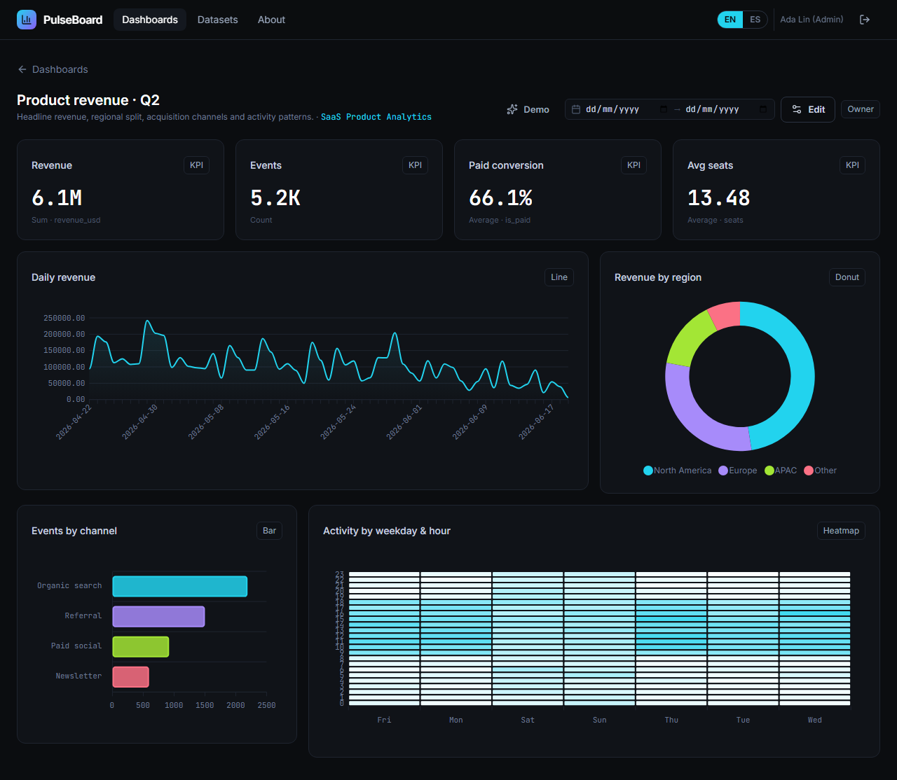
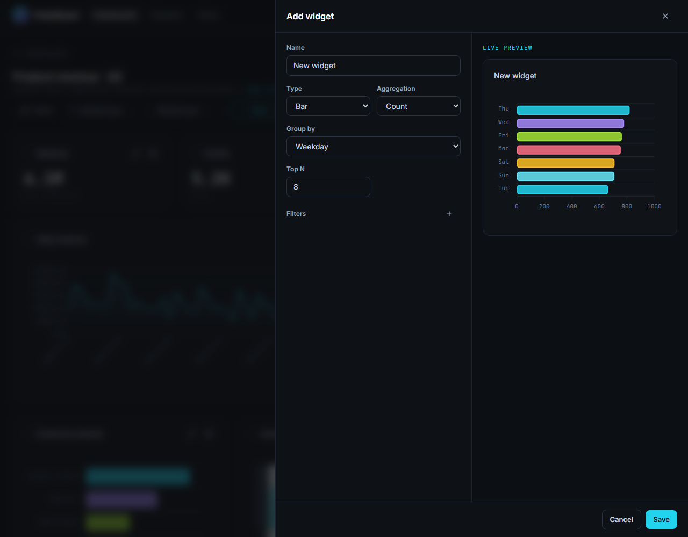
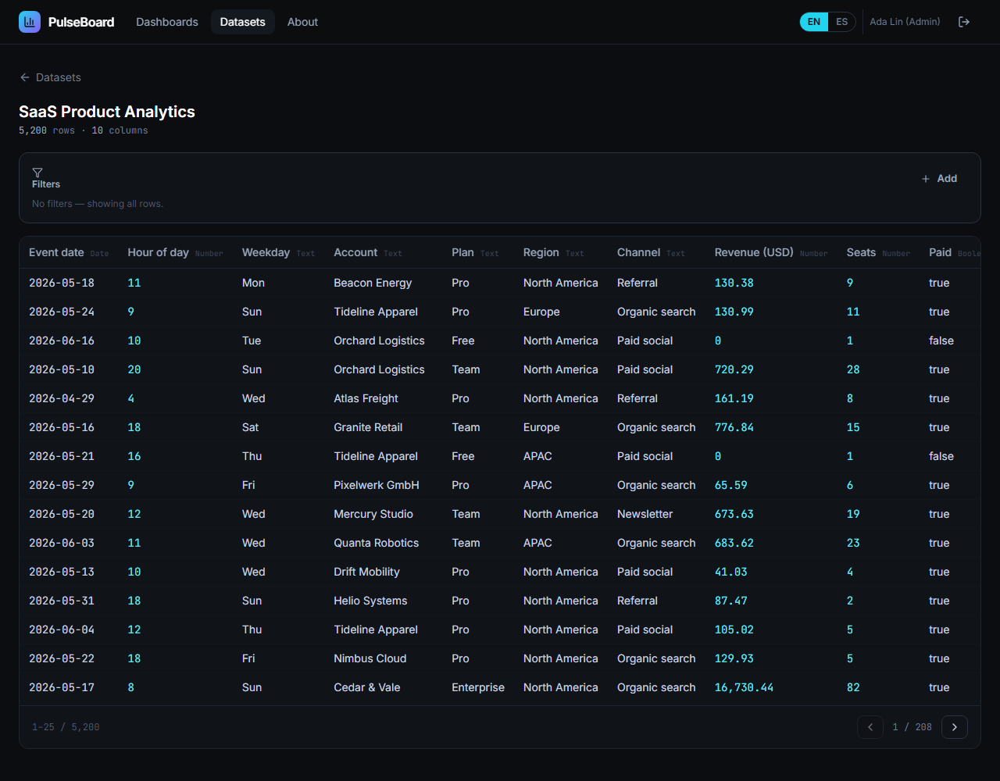
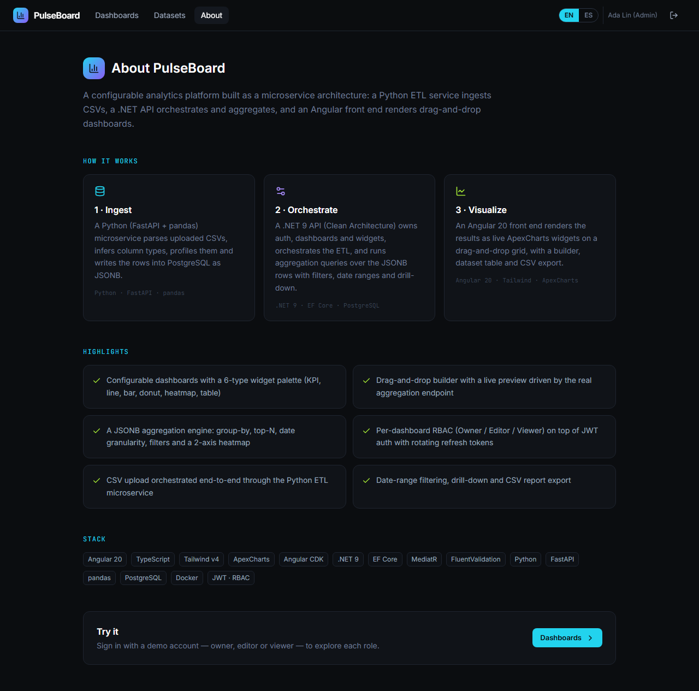

# PulseBoard — analytics command center

A configurable **business-intelligence platform** built as a microservice architecture: a Python
ETL service ingests CSVs, a .NET API orchestrates and aggregates, and an Angular front end renders
drag-and-drop dashboards over a JSONB analytics store.



---

## Overview

Upload a CSV (or use the bundled sample), and PulseBoard profiles it, stores it, and lets you build
dashboards of charts over it — KPIs, line, bar, donut and heatmap widgets — with a live-preview
builder, per-dashboard roles, date-range filtering, drill-down and CSV export.

## Architecture

```
                ┌──────────────────────┐
   CSV upload   │  Angular 20 SPA      │   ApexCharts · Tailwind v4 · CDK drag&drop
 ───────────────►  (dashboards, builder,│
                │   dataset table)     │
                └──────────┬───────────┘
                           │  REST + JWT
                ┌──────────▼───────────┐        ┌───────────────────────┐
                │  .NET 9 API          │  HTTP  │  Python ETL           │
                │  Clean Architecture  ├────────►  FastAPI + pandas     │
                │  · auth / RBAC       │ /ingest│  · parse + profile CSV │
                │  · dashboards/widgets│        │  · write JSONB rows    │
                │  · aggregation engine│        └───────────┬───────────┘
                └──────────┬───────────┘                    │
                           │            ┌───────────────────▼┐
                           └────────────►   PostgreSQL 18     │  rows as JSONB + metadata
                                        └─────────────────────┘
```

The .NET API and the Python ETL share one PostgreSQL database. The ETL owns ingestion (parse →
type-infer → profile → write rows as JSONB); the API owns everything else, including the
**aggregation engine** that turns a widget spec into parameterized SQL over `dataset_rows.data`.

See [docs/TECHNICAL.md](docs/TECHNICAL.md) for the deep dive.

## Features

- **Configurable dashboards** with a 6-type widget palette: KPI, line, bar, donut, heatmap, table.
- **Drag-and-drop builder** with a live preview driven by the same aggregation endpoint the saved
  widget uses — what you build is what you get.
- **JSONB aggregation engine**: group-by, top-N, date granularity (day/week/month), filters
  (`eq/ne/gt/gte/lt/lte/contains/in`), date ranges, drill-down and a 2-axis heatmap.
- **Per-dashboard RBAC** (Owner / Editor / Viewer) on top of JWT auth with rotating refresh tokens
  and account lockout.
- **CSV upload** orchestrated end-to-end through the Python ETL microservice.
- **CSV report export** per widget, **EN/ES** i18n, and a guided demo tour.

## Tech stack

| Layer | Tech |
|-------|------|
| Front | Angular 20 (standalone + signals), TypeScript, Tailwind v4, ApexCharts, Angular CDK |
| API | .NET 9, Clean Architecture, EF Core, MediatR, FluentValidation, Npgsql |
| ETL | Python 3.12, FastAPI, pandas, psycopg 3 |
| Data | PostgreSQL 18 (JSONB) |
| Auth | JWT + rotating refresh tokens, per-dashboard RBAC |
| Infra | Docker Compose (multi-service), GitHub Actions CI |

## Demo accounts

| Role | Email | Password |
|------|-------|----------|
| Owner | `admin@pulseboard.io` | `Admin123!` |
| Editor | `editor@pulseboard.io` | `Editor123!` |
| Viewer | `viewer@pulseboard.io` | `Viewer123!` |

## Run it locally

Prerequisites: Docker, .NET 9 SDK, Node 20+, Python 3.12.

```bash
# 1. Postgres + ETL service
docker compose up -d                 # db on :55432, etl on :8100

# 2. API (applies migrations + seeds the demo data on boot)
cd backend && dotnet run --project src/PulseBoard.Api   # http://localhost:5180

# 3. Front end
cd frontend && npm install && npm start                 # http://localhost:4200
```

Open http://localhost:4200 and sign in with a demo account.

## Testing

```bash
# Backend — 36 unit tests (aggregation SQL builder, auth, RBAC, CSV, domain)
cd backend && dotnet test

# ETL — 8 tests (CSV parsing, type inference, profiling)
cd etl && pytest

# Front end — strict E2E (full journey, asserts zero console errors)
cd frontend && npm run e2e        # needs the stack from "Run it locally" running
```

## Project structure

```
pulseboard/
├── backend/     .NET 9 API — Domain / Application / Infrastructure / Api + tests
├── etl/         Python FastAPI + pandas ETL microservice + tests
├── frontend/    Angular 20 SPA (+ Playwright e2e)
├── docker-compose.yml
└── docs/        PHASES.md · TECHNICAL.md · screenshots
```

## Screenshots

| Dashboard | Builder |
|-----------|---------|
|  |  |

| Dataset table | About |
|---------------|-------|
|  |  |

---

Built by **Luis Chiquito Vera** as part of a software-engineering portfolio.
